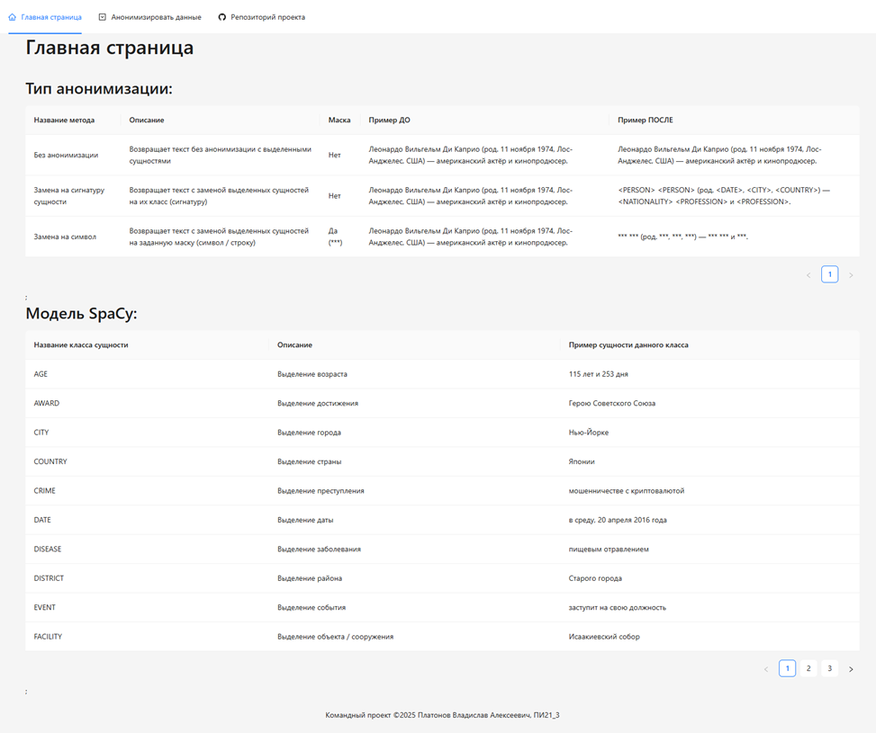
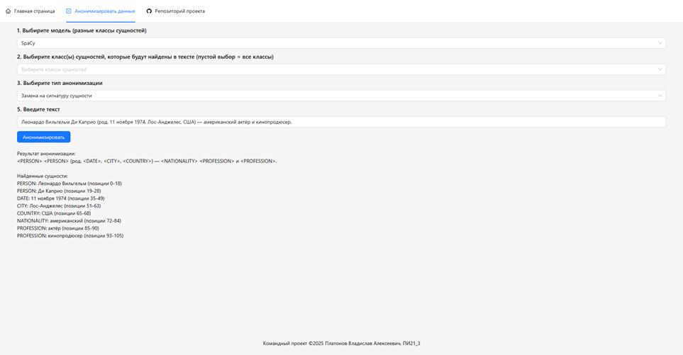

# АНОНИМИЗАЦИЯ ПЕРСОНАЛЬНЫХ ДАННЫХ В НЕСТРУКТУРИРОВАННОМ ТЕКСТЕ

## Структура проекта:

```
hse-personal-data-anonymisation/
|-backend/ - серверная часть
    |-classes/ - классы для работы с моделями
    |-models/ - предобученные модели
    |-main.py - эндпоинты и запуск сервера
    ...
|-frontend/ - клиентская часть
...
```

---

## Начало использования:

Требования для запуска веб-приложения: ```Python 1.12.6``` 

Для запуска проекта локально, необходимо совершить действия, описанные ниже:

1. Создайте локальную копию репозитория:

    ```
    git clone https://github.com/vl4xd/hse-personal-data-anonymisation.git
    ```


### Запуск серверной части

2. Перейдите в дирректорию ```/backend```

3. Создайте виртуальное окружение:

    ```
    python -m venv venv
    ```

4. Активируйте виртуальное окружение:

    ```
    .\venv\Scripts\activate
    ```

5. Установите зависимости:

    ```
    pip install -r requirements.txt
    ```

6. Запустите серверную часть:

    ```
    python main.py
    ```

7. Перейдите по ссылке в подсказке терминала (необязательно).

### Запуск клиентской части:

8. Перейдите в дирректорию ```/frontend```

9. Запустите команду:

    ```
    npm install
    ```

10. Перейдите по ссылке в подсказке терминала.

### Ветки обучения моделей:

- обучение модели SpaCy - [spacy-model-train](https://github.com/vl4xd/hse-personal-data-anonymisation/tree/spacy-model-train)

## Пример работы веб-приложения:

#### Главная страница


#### Анонимизация текста в формате строки


---

## О проекте:

**Цель проекта** – создание программного инструмента для обеспечения конфиденциальности ПД в текстовых данных за счет автоматической анонимизации.

### Функциональные требования

Разрабатываемый продукт, должен включать следующие возможности:
- выбрать предобученную модель NER;
- выбрать сущности из доступных для выбранной модели;
- просмотреть примеры сущностей из данных для обучения выбранной модели;
- выбрать тип анонимизации;
- анонимизировать данные в формате строки.

### Нефункциональные требования

Предъявляемые атрибуты качества к разрабатываемому продукту:
- внешние качества:
    - совместимость;
    - удобство использования.
- внутренние качества:
    - возможность модификации.

Требования для атрибутов качества:
- совместимость:
    - клиентская часть система должна реализовывать весь свой функционал в последних версиях настольных браузеров: Chrome, Firefox, Safari, Yandex Browser.
- удобство использования:
    - интерфейс клиентской части с примерами и алгоритмом действий;
    - актуальная документация по реализованному API;
    - актуальная документация по реализованным функциям и классам.
    - возможность модификации:
    - код с учетом принципов KISS, YAGNI, DRY и SOLID.

---

*Командный проект, НИУ ВШЭ Пермь 2025.*

*Задание выполнил: Платонов Владислав Алексеевич.*
